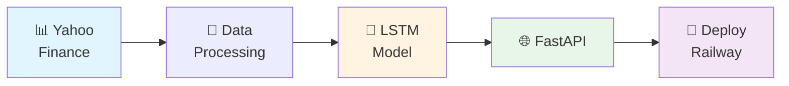

# 🎤 Guia de Apresentação do Projeto

> Material para apresentar o Tech Challenge Fase 4

---

## 📋 Roteiro de Apresentação (15-20 minutos)

### 1. Introdução (2 minutos) 🎯

**Slide 1: Título**
```
📈 Sistema de Previsão de Preços de Ações com LSTM

Tech Challenge Fase 4 - FIAP Pós-Tech MLET

[Seu Nome]
Dezembro 2024
```

**Slide 2: O Problema**
```
❓ Desafio
- Prever preços de ações é complexo
- Mercado altamente volátil
- Muitos fatores influenciam preços

🎯 Objetivo
- Criar sistema completo de ML Engineering
- Do dado bruto ao deploy em produção
- Aplicar boas práticas da indústria
```

**O que falar:**
> "O desafio era criar um sistema completo de previsão de preços de ações, aplicando as técnicas de ML Engineering aprendidas na pós. Não é apenas sobre criar um modelo, mas sim sobre construir um sistema production-ready, desde a coleta de dados até o deploy em produção."

---

### 2. Solução Proposta (3 minutos) 🏗️

**Slide 3: Arquitetura Geral**

Use o diagrama:



**O que falar:**
> "A solução segue uma arquitetura em camadas: começamos coletando dados do Yahoo Finance, fazemos feature engineering com 16 indicadores técnicos, treinamos um modelo LSTM em PyTorch, servimos via API REST com FastAPI, e fazemos deploy em produção na Railway."

**Slide 4: Stack Tecnológica**

```
🐍 Python 3.10
🔥 PyTorch (LSTM)
⚡ FastAPI (API REST)
📊 yfinance (Dados)
🐳 Docker (Containerização)
🚂 Railway (Cloud)
🤗 HuggingFace (UI Demo)
```

**O que falar:**
> "Escolhemos tecnologias modernas e amplamente usadas na indústria: PyTorch pela flexibilidade, FastAPI pela performance e documentação automática, e Docker para garantir que roda igual em qualquer ambiente."

---

### 3. Deep Dive Técnico (5 minutos) 🔍

**Slide 5: Feature Engineering**

```
16 Features Criadas:

📊 Preços Base (5)
- Open, High, Low, Close, Volume

📈 Variações (4)
- Price Change %
- High-Low %
- Close-Open %
- Volume Change %

📉 Médias Móveis (3)
- MA 7, 30, 90 dias

💨 Volatilidade (2)
- Vol 7, 30 dias

⚡ Momentum (2)
- Momentum 4 dias
- Volume MA 7 dias
```

**O que falar:**
> "Não usamos apenas os preços brutos. Criamos 16 features que capturam diferentes aspectos do comportamento da ação: tendências com médias móveis, risco com volatilidade, e força do movimento com momentum. Todas são normalizadas entre 0 e 1."

**Slide 6: Arquitetura LSTM**

```
Entrada: [60 dias × 16 features]
    ↓
LSTM Layer 1 (50 neurons)
    ↓
Dropout 20%
    ↓
LSTM Layer 2 (50 neurons)
    ↓
Dropout 20%
    ↓
Fully Connected (50 → 1)
    ↓
Saída: Preço previsto
```

**O que falar:**
> "O modelo usa 60 dias de histórico como 'janela de contexto'. O LSTM tem 2 camadas com 50 neurônios cada e dropout de 20% para evitar overfitting. A entrada é uma matriz 60x16 e a saída é um único valor: o preço previsto."

**Slide 7: Pipeline de Treinamento**

Use o diagrama do GUIA_VISUAL.md mostrando o fluxo de treinamento completo.

**O que falar:**
> "O pipeline de treinamento é completamente automatizado: baixa dados, cria features, normaliza, cria sequências, treina por 50 épocas com validação, avalia com 5 métricas diferentes, e salva tudo: modelo, preprocessador e metadata."

---

### 4. Resultados (3 minutos) 📊

**Slide 8: Métricas de Avaliação**

```
📊 Resultado para AAPL (Apple):

RMSE:  $3.45  (1.9% do preço)
MAE:   $2.67  (1.5% do preço)
MAPE:  1.89%  ← Excelente! (< 10%)
R²:    0.9567 ← Muito bom! (explica 95.67%)
Dir:   76.47% ← Bom! (acerta 3 de 4)

✅ Modelo com boa capacidade preditiva
```

**O que falar:**
> "Os resultados são muito promissores. O erro percentual médio (MAPE) é de apenas 1.89%, o que é excelente para previsão de ações. O R² de 0.95 significa que o modelo explica 95% da variância. E ele acerta a direção (subida ou descida) em 76% dos casos, o que é bem acima do acaso."

**Slide 9: Exemplo Real**

```
Previsão Real vs Realidade:

Data:      2024-12-01
Previsto:  $185.50
Real:      $184.80
Erro:      $0.70 (0.38%)

Direção:   ✅ Acertou (ambos subindo)

Status:    Previsão precisa!
```

**O que falar:**
> "Aqui um exemplo real: o modelo previu $185.50 e o preço real foi $184.80. Um erro de apenas 70 centavos, ou 0.38%. E acertou a direção do movimento."

---

### 5. API e Deploy (3 minutos) 🌐

**Slide 10: API REST**

```
🌐 Endpoints Principais:

POST /api/v1/predict
- Fazer previsão para uma ação

POST /api/v1/predict/batch  
- Previsões em lote

GET /api/v1/stocks/{symbol}/historical
- Dados históricos

POST /api/v1/models/train
- Retreinar modelo

GET /api/v1/health
- Health check

📚 Documentação automática: /docs
```

**Demo ao vivo (1 min):**
- Mostrar Swagger UI
- Fazer uma previsão
- Mostrar resposta JSON

**O que falar:**
> "A API é completamente RESTful e auto-documentada. Aqui está o Swagger mostrando todos os endpoints. Vou fazer uma previsão ao vivo... [executar]... e aqui está a resposta em JSON com o preço previsto, atual, e a variação percentual."

**Slide 11: Deploy em Produção**

```
🚀 Infraestrutura:

Railway (Backend API)
- Auto-deploy via Git push
- Health checks automáticos
- Logs centralizados

HuggingFace Spaces (UI Demo)
- Interface Gradio
- Disponível publicamente
- Gratuito

Docker
- Containerizado
- Multi-stage build
- Reproducível

CI/CD
- GitHub Actions
- Testes automatizados
- Build automatizado
```

**Demo ao vivo (opcional):**
- Mostrar HuggingFace Space funcionando
- Fazer previsão pela UI

---

### 6. ML Engineering Practices (2 minutos) 🎓

**Slide 12: Boas Práticas Aplicadas**

```
✅ Separation of Concerns
   - Data, Model, API, Deploy separados

✅ Configuration Management
   - Tudo configurável via env vars

✅ Model Versioning
   - Metadata com cada modelo

✅ Logging & Monitoring
   - Logs estruturados (Loguru)
   - Métricas (Prometheus)

✅ Testing
   - Testes automatizados (pytest)
   - 4 test suites

✅ Containerization
   - Docker multi-stage

✅ CI/CD
   - GitHub Actions pipeline

✅ Documentation
   - 7 documentos completos
   - 30+ diagramas Mermaid
```

**O que falar:**
> "O projeto não é apenas sobre o modelo. Aplicamos as principais práticas de ML Engineering: separação de responsabilidades, versionamento de modelos, testes automatizados, containerização, CI/CD, e documentação completa. Tudo que um projeto production-ready precisa."

---

### 7. Conclusão (2 minutos) 🎯

**Slide 13: O que Foi Entregue**

```
✅ Coleta de Dados
   - yfinance automático

✅ Modelo LSTM
   - PyTorch, 2 camadas, 16 features

✅ Training Pipeline
   - Completamente automatizado

✅ Avaliação
   - 5 métricas (MAE, RMSE, MAPE, R², Dir)

✅ API REST
   - FastAPI, 10+ endpoints

✅ Monitoramento
   - Logs, métricas, health checks

✅ Deploy
   - Railway + HuggingFace + Docker

✅ Documentação
   - 150+ páginas, 30+ diagramas

✅ Testes
   - Suite completa
```

**Slide 14: Aprendizados**

```
🎓 Conhecimentos Aplicados:

• Deep Learning (LSTM)
• Feature Engineering
• Time Series
• API Development
• Containerização
• Cloud Deploy
• CI/CD
• Monitoring
• Documentation
• Software Engineering Best Practices
```

**O que falar:**
> "Este projeto me permitiu aplicar na prática tudo que aprendemos: desde deep learning com LSTM, passando por feature engineering, desenvolvimento de APIs, até deploy em produção com monitoramento. Foi uma experiência completa de ML Engineering."

**Slide 15: Próximos Passos**

```
🚀 Melhorias Futuras:

1. Banco de dados (PostgreSQL/Timescale)
2. Cache (Redis)
3. Mais modelos (Transformer, Prophet)
4. Ensemble de modelos
5. A/B Testing
6. Retreinamento automático
7. Dashboard Grafana
8. Autenticação JWT
```

---

## 🎬 Dicas para Apresentação

### Antes da Apresentação

- [ ] Testar API localmente (garantir que funciona)
- [ ] Ter modelo treinado e pronto
- [ ] Testar demos ao vivo
- [ ] Ter backup se internet falhar
- [ ] Imprimir slide de referência
- [ ] Cronometrar (ensaiar 2-3x)

### Durante a Apresentação

**DO ✅**
- Falar com entusiasmo
- Olhar para a audiência
- Usar os diagramas para explicar
- Mostrar código quando relevante
- Fazer demos ao vivo (se possível)
- Relacionar com o que aprendeu na pós

**DON'T ❌**
- Ler slides
- Ficar apenas no código
- Passar slides muito rápido
- Usar jargão sem explicar
- Esquecer de contextualizar

### Perguntas Frequentes (Prepare-se!)

**Q: Por que LSTM e não Transformer?**
> "LSTM é um bom equilíbrio entre simplicidade e performance para este problema. Transformers são mais complexos e demandam mais dados. Para um projeto educacional focado em aplicar ML Engineering practices, LSTM foi ideal."

**Q: Como garantem que o modelo não overfittou?**
> "Usamos 3 estratégias: dropout de 20% nas camadas LSTM, validação em dados não vistos durante treino, e avaliação em test set completamente separado. As métricas mostram boa generalização."

**Q: Pode ser usado para trading real?**
> "NÃO! Este é um projeto educacional. Mercado de ações é complexo e tem muitos fatores não capturados pelo modelo. Sempre consulte profissionais para decisões de investimento."

**Q: Qual a latência da API?**
> "Aproximadamente 200ms por previsão, incluindo download de dados do Yahoo Finance. Isso pode ser otimizado com cache."

**Q: Como escala o sistema?**
> "Horizontalmente com múltiplas instâncias atrás de load balancer, e com cache Redis para dados. A arquitetura foi desenhada para isso."

**Q: Quanto custou o projeto?**
> "Zero! Usei apenas ferramentas gratuitas: Yahoo Finance para dados, Railway tier grátis para API, HuggingFace Spaces grátis para UI, e GitHub Actions grátis para CI/CD."

---

## 📸 Material Visual Recomendado

### Screenshots para Incluir

1. **Swagger UI** (`http://localhost:8000/docs`)
   - Mostra profissionalismo da API

2. **Resposta JSON de previsão**
   - Mostra estrutura de dados

3. **Logs estruturados**
   - Mostra monitoring

4. **Gradio UI** (HuggingFace Space)
   - Mostra interface visual

5. **Gráfico de previsões vs real**
   - Mostra acurácia visual

6. **GitHub Actions Pipeline**
   - Mostra CI/CD funcionando

### Diagramas para Incluir

Use os diagramas do `GUIA_VISUAL.md`:
- Arquitetura geral
- Fluxo de treinamento
- Fluxo de predição
- Anatomia do LSTM
- Transformação dos dados

---

## 🎯 Checklist Pré-Apresentação

### Técnico

- [ ] API rodando e testada
- [ ] Pelo menos 1 modelo treinado (AAPL)
- [ ] Swagger acessível
- [ ] HuggingFace Space no ar (se aplicável)
- [ ] Exemplos de cURL testados
- [ ] Notebooks executados

### Apresentação

- [ ] Slides prontos
- [ ] Tempo cronometrado (15-20 min)
- [ ] Demos testadas
- [ ] Backup de slides (PDF)
- [ ] Screenshots capturadas
- [ ] Respostas para perguntas preparadas

### Documentação

- [ ] README acessível
- [ ] Links funcionando
- [ ] Repositório organizado
- [ ] .gitignore configurado (sem .env)

---

## 💡 Argumentos de Venda

### Diferencial 1: Completude
> "Não é apenas um modelo. É um sistema completo: do dado bruto ao deploy em produção."

### Diferencial 2: Boas Práticas
> "Aplica as principais práticas de ML Engineering: versionamento, testes, CI/CD, monitoring."

### Diferencial 3: Documentação
> "150 páginas de documentação com 30+ diagramas. Qualquer pessoa pode entender e replicar."

### Diferencial 4: Production-Ready
> "Não é código de notebook. É um sistema que pode ir para produção hoje."

### Diferencial 5: Replicável
> "Containerizado com Docker. Funciona igual em qualquer ambiente. Fácil de escalar."

---

## 📊 Estrutura de Slide Deck

### Sugestão de 15 Slides

1. **Título** - Nome, projeto, data
2. **O Problema** - Contexto e desafio
3. **Arquitetura Geral** - Diagrama high-level
4. **Stack Tecnológica** - Tecnologias usadas
5. **Feature Engineering** - 16 features
6. **Arquitetura LSTM** - Modelo neural
7. **Pipeline de Treinamento** - Fluxo
8. **Métricas de Avaliação** - Resultados
9. **Exemplo Real** - Previsão vs realidade
10. **API REST** - Endpoints e demo
11. **Deploy** - Infraestrutura
12. **ML Engineering** - Boas práticas
13. **Entregáveis** - O que foi feito
14. **Aprendizados** - Conhecimentos aplicados
15. **Próximos Passos** - Melhorias futuras

---

## 🎤 Script de 3 Minutos (Elevator Pitch)

> "Desenvolvi um sistema completo de previsão de preços de ações usando LSTM, aplicando as principais práticas de ML Engineering.
>
> O sistema coleta dados do Yahoo Finance, cria 16 features técnicas como médias móveis e volatilidade, treina um modelo LSTM em PyTorch com 2 camadas, e serve previsões via API REST com FastAPI.
>
> Os resultados para Apple (AAPL) mostram erro de apenas 1.89% e acurácia direcional de 76%, bem acima do acaso.
>
> A API está documentada automaticamente com Swagger, containerizada com Docker, e deployada na Railway com CI/CD via GitHub Actions. Também criei uma interface Gradio no HuggingFace Spaces para demo.
>
> O diferencial é que não é apenas um modelo - é um sistema production-ready completo: testes automatizados, logging estruturado, métricas Prometheus, e documentação de 150 páginas com 30+ diagramas.
>
> Qualquer pessoa pode clonar o repositório, rodar 'docker-compose up', e ter o sistema funcionando em minutos. É completamente replicável e segue as boas práticas da indústria."

---

## 🏆 Mensagem Final

**O que você quer que eles lembrem:**

1. ✅ **Sistema completo**, não apenas modelo
2. ✅ **Production-ready**, não código de notebook
3. ✅ **Boas práticas** de ML Engineering aplicadas
4. ✅ **Documentação excepcional**
5. ✅ **Resultados validados** com métricas sólidas

---

**Boa sorte na apresentação! 🚀**

*Você construiu algo incrível. Mostre com orgulho!*

---

*Criado para Tech Challenge Fase 4 - FIAP Pós-Tech MLET*

*Última atualização: Dezembro 2024*

