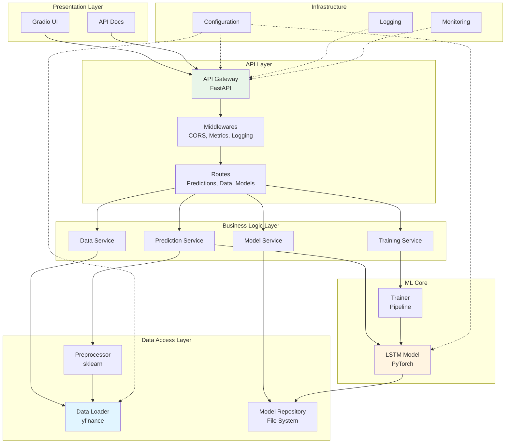
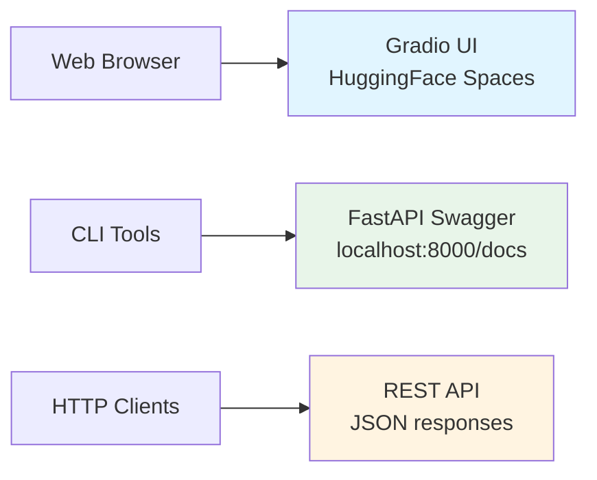
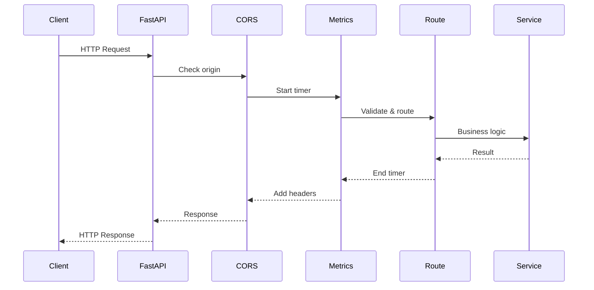
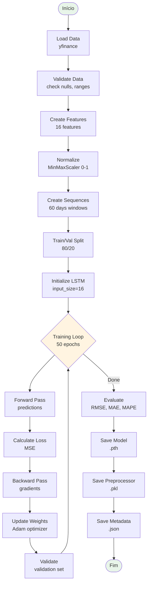
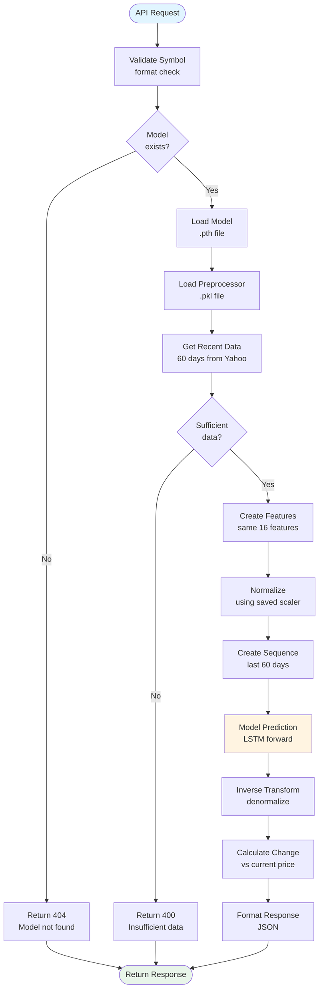
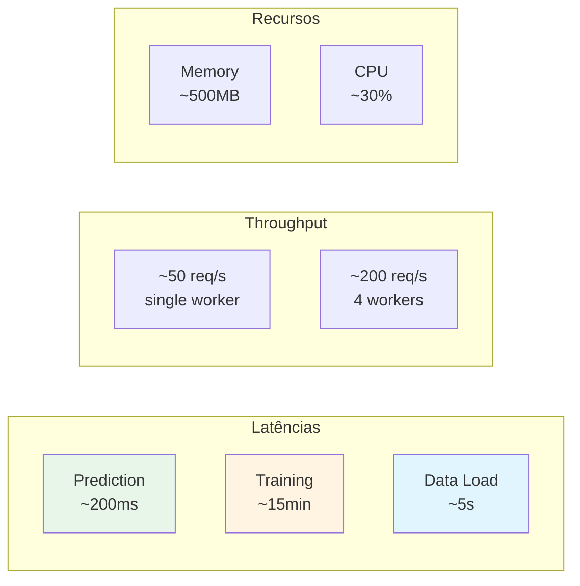
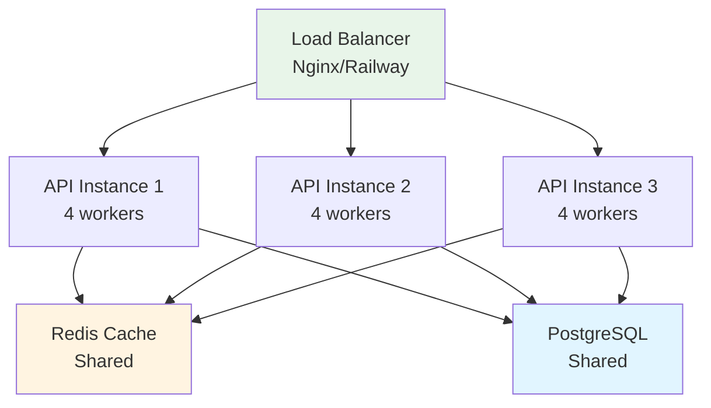

# 🏛️ Arquitetura Técnica Detalhada

> Documento técnico explicando a arquitetura do sistema de previsão de ações

---

## 📋 Índice

- [Visão Geral](#visão-geral)
- [Arquitetura em Camadas](#arquitetura-em-camadas)
- [Fluxo de Dados](#fluxo-de-dados)
- [Componentes Principais](#componentes-principais)
- [Decisões de Design](#decisões-de-design)
- [Padrões Utilizados](#padrões-utilizados)
- [Performance e Escalabilidade](#performance-e-escalabilidade)

---

## 🎯 Visão Geral

O sistema segue uma **arquitetura em camadas** (layered architecture) com separação clara de responsabilidades:



---

## 📚 Arquitetura em Camadas

### 1. Presentation Layer (Camada de Apresentação)

**Responsabilidade**: Interface com o usuário



**Componentes**:
- **Gradio UI** (`app_gradio.py`): Interface gráfica para demos
- **Swagger/ReDoc**: Documentação interativa da API
- **HTTP Clients**: cURL, Python requests, etc.

### 2. API Layer (Camada de API)

**Responsabilidade**: Roteamento, validação, middlewares

```python
# src/api/main.py
app = FastAPI(
    title="Stock Price Prediction API",
    version="1.0.0"
)

# Middlewares
app.add_middleware(CORSMiddleware)
app.middleware("http")(add_process_time_and_metrics)

# Routes
app.include_router(predictions.router, prefix="/api/v1")
app.include_router(data.router, prefix="/api/v1")
app.include_router(models.router, prefix="/api/v1")
app.include_router(monitoring.router, prefix="/api/v1")
```

**Componentes**:
- **FastAPI App**: Entry point
- **CORS Middleware**: Cross-origin requests
- **Metrics Middleware**: Coleta de métricas
- **Exception Handlers**: Tratamento de erros
- **Routers**: Organização de endpoints

**Fluxo de Request:**



### 3. Business Logic Layer (Camada de Lógica de Negócio)

**Responsabilidade**: Orquestração e regras de negócio

```python
# src/api/routes/predictions.py
@router.post("/predict")
async def predict_stock_price(request: PredictionRequest):
    # 1. Validar request
    validate_symbol(request.symbol)
    
    # 2. Carregar modelo
    model = load_model(request.symbol)
    
    # 3. Obter dados
    data = get_recent_data(request.symbol)
    
    # 4. Preprocessar
    X = preprocessor.transform_for_prediction(data)
    
    # 5. Prever
    prediction = model.predict(X)
    
    # 6. Formatar resposta
    return format_prediction_response(prediction)
```

**Serviços**:
- **Prediction Service**: Orquestra previsões
- **Training Service**: Orquestra treinamento
- **Data Service**: Gerencia dados
- **Model Service**: Gerencia modelos

### 4. Data Access Layer (Camada de Acesso a Dados)

**Responsabilidade**: Interação com fontes de dados

```python
# src/data/data_loader.py
class StockDataLoader:
    def load_stock_data(self, symbol, start_date, end_date):
        # Download do Yahoo Finance
        df = yf.download(symbol, start=start_date, end=end_date)
        
        # Validação
        self.validate_data(df)
        
        return df
```

**Componentes**:
- **DataLoader**: Coleta dados do Yahoo Finance
- **Preprocessor**: Transforma dados
- **Model Repository**: Salva/carrega modelos
- **Cache**: (futuro) Cache de dados

### 5. ML Core (Núcleo de Machine Learning)

**Responsabilidade**: Treinamento e inferência

```python
# src/models/lstm_model.py
class LSTMModel(nn.Module):
    def __init__(self, input_size, hidden_size, num_layers):
        super().__init__()
        self.lstm = nn.LSTM(
            input_size=input_size,
            hidden_size=hidden_size,
            num_layers=num_layers,
            batch_first=True,
            dropout=0.2
        )
        self.fc = nn.Linear(hidden_size, 1)
    
    def forward(self, x):
        lstm_out, _ = self.lstm(x)
        output = self.fc(lstm_out[:, -1, :])
        return output
```

**Componentes**:
- **LSTMModel**: Arquitetura PyTorch
- **LSTMPredictor**: Wrapper para treino/inferência
- **Trainer**: Pipeline de treinamento

---

## 🔄 Fluxo de Dados

### Pipeline de Treinamento Completo



### Pipeline de Inferência (Predição)



---

## 🧩 Componentes Principais

### 1. DataLoader (Coleta de Dados)

**Responsabilidades**:
- Download de dados do Yahoo Finance
- Validação de dados
- Padronização de formato
- Tratamento de erros

**Tecnologias**:
- `yfinance`: API do Yahoo Finance
- `pandas`: Manipulação de DataFrames

**Principais Métodos**:

```python
class StockDataLoader:
    def load_stock_data(symbol, start_date, end_date) -> DataFrame
    def validate_data(df) -> bool
    def get_latest_price(symbol) -> dict
```

**Features do DataFrame**:
```python
['timestamp', 'open', 'high', 'low', 'close', 'volume',
 'year', 'month', 'day', 'day_of_week', 'symbol']
```

### 2. Preprocessor (Feature Engineering)

**Responsabilidades**:
- Criar features técnicas
- Normalizar dados
- Criar sequências para LSTM
- Inverse transform para previsões

**Features Criadas**:

| Categoria | Feature | Cálculo |
|-----------|---------|---------|
| **Price Changes** | `price_change` | `close.pct_change()` |
| | `high_low_pct` | `(high - low) / low` |
| | `close_open_pct` | `(close - open) / open` |
| **Moving Averages** | `ma_7` | `close.rolling(7).mean()` |
| | `ma_30` | `close.rolling(30).mean()` |
| | `ma_90` | `close.rolling(90).mean()` |
| **Volatility** | `volatility_7` | `close.rolling(7).std()` |
| | `volatility_30` | `close.rolling(30).std()` |
| **Volume** | `volume_change` | `volume.pct_change()` |
| | `volume_ma_7` | `volume.rolling(7).mean()` |
| **Momentum** | `momentum` | `close - close.shift(4)` |

**Principais Métodos**:

```python
class StockDataPreprocessor:
    def fit_transform(df) -> (X, y, df_processed)
    def transform(df) -> (X, y, df_processed)
    def transform_for_prediction(df) -> X
    def inverse_transform_target(scaled_value) -> float
    def save(path)
    def load(path) -> StockDataPreprocessor
```

### 3. LSTM Model (Modelo Neural)

**Arquitetura**:

```python
LSTMModel(
  (lstm): LSTM(16, 50, num_layers=2, batch_first=True, dropout=0.2)
  (fc): Linear(in_features=50, out_features=1, bias=True)
  (dropout): Dropout(p=0.2, inplace=False)
)
```

**Parâmetros**:
- **Input Size**: 16 features
- **Hidden Size**: 50 neurons
- **Num Layers**: 2 camadas LSTM
- **Dropout**: 0.2 (20% de regularização)
- **Output Size**: 1 (preço previsto)

**Shape Flow**:

```
Input:  [batch_size, 60, 16]  # 60 dias, 16 features
                ↓
LSTM:   [batch_size, 60, 50]  # 50 hidden units
                ↓
Last:   [batch_size, 50]      # último timestep
                ↓
Dropout: [batch_size, 50]      # regularização
                ↓
FC:     [batch_size, 1]        # previsão final
```

**Principais Métodos**:

```python
class LSTMPredictor:
    def fit(X_train, y_train, X_val, y_val, epochs, batch_size)
    def train_epoch(X_train, y_train, batch_size) -> loss
    def validate(X_val, y_val, batch_size) -> loss
    def predict(X) -> predictions
    def save(path)
    def load(path) -> LSTMPredictor
```

### 4. Trainer (Orquestrador de Treinamento)

**Responsabilidades**:
- Carregar dados
- Preprocessar
- Treinar modelo
- Avaliar performance
- Salvar artifacts

**Pipeline**:

```python
class ModelTrainer:
    def run_training_pipeline(start_date, end_date):
        # 1. Load data
        df = self.load_data(start_date, end_date)
        
        # 2. Prepare data
        X_train, y_train, X_test, y_test = self.prepare_data(df)
        
        # 3. Train model
        self.train_model(X_train, y_train, X_val, y_val)
        
        # 4. Evaluate
        metrics = self.evaluate_model(X_test, y_test)
        
        # 5. Save
        self.save_model()
        
        return metrics
```

### 5. FastAPI Routes (Endpoints)

**Organização**:

```
src/api/routes/
├── predictions.py     # POST /predict, /predict/batch
├── data.py           # GET /stocks/{symbol}/historical
├── models.py         # POST /models/train
└── monitoring.py     # GET /health, /metrics
```

**Exemplo de Route**:

```python
# src/api/routes/predictions.py
from fastapi import APIRouter, HTTPException
from src.api.schemas import PredictionRequest, PredictionResponse

router = APIRouter()

@router.post("/predict", response_model=PredictionResponse)
async def predict_stock_price(request: PredictionRequest):
    """Fazer previsão de preço de ação."""
    try:
        # Business logic
        result = prediction_service.predict(
            symbol=request.symbol,
            days_ahead=request.days_ahead
        )
        return result
    except ModelNotFoundError:
        raise HTTPException(status_code=404, detail="Model not found")
    except Exception as e:
        raise HTTPException(status_code=500, detail=str(e))
```

---

## 🎨 Decisões de Design

### 1. Por que FastAPI?

**Alternativas consideradas**: Flask, Django REST Framework

**Escolha: FastAPI**

✅ **Vantagens**:
- Performance alta (baseado em Starlette/Uvicorn)
- Validação automática com Pydantic
- Documentação automática (Swagger/OpenAPI)
- Type hints nativos
- Async/await support

❌ **Desvantagens**:
- Comunidade menor que Flask
- Menos plugins/extensions

### 2. Por que PyTorch?

**Alternativas consideradas**: TensorFlow/Keras

**Escolha: PyTorch**

✅ **Vantagens**:
- Mais pythonic e intuitivo
- Debug mais fácil (execução dinâmica)
- Research-friendly
- Boa documentação

❌ **Desvantagens**:
- Deploy pode ser mais pesado
- Menos ferramentas prontas

### 3. Por que yfinance?

**Alternativas consideradas**: Alpha Vantage, IEX Cloud

**Escolha: yfinance**

✅ **Vantagens**:
- Gratuito e sem API key
- Dados confiáveis (Yahoo Finance)
- Fácil de usar
- Histórico extenso

❌ **Desvantagens**:
- Não oficial (pode quebrar)
- Rate limits
- Dados atrasados (15min)

### 4. Arquitetura em Camadas vs Microservices

**Escolha: Arquitetura em Camadas (Monolito Modular)**

✅ **Vantagens**:
- Mais simples de desenvolver e debugar
- Menos overhead de rede
- Suficiente para escala do projeto
- Deploy mais fácil

❌ **Quando usar Microservices**:
- Necessidade de escalar componentes independentemente
- Múltiplas equipes trabalhando
- Requisitos de disponibilidade diferentes

---

## 🔧 Padrões Utilizados

### 1. Repository Pattern

```python
# Abstração do acesso a dados
class ModelRepository:
    def save(model, path):
        torch.save(model.state_dict(), path)
    
    def load(path):
        model = LSTMModel()
        model.load_state_dict(torch.load(path))
        return model
```

### 2. Factory Pattern

```python
# Criação de modelos
class ModelFactory:
    @staticmethod
    def create_model(model_type, **kwargs):
        if model_type == "lstm":
            return LSTMPredictor(**kwargs)
        elif model_type == "gru":
            return GRUPredictor(**kwargs)
```

### 3. Dependency Injection

```python
# Injeção de dependências
class PredictionService:
    def __init__(self, model_loader, data_loader, preprocessor):
        self.model_loader = model_loader
        self.data_loader = data_loader
        self.preprocessor = preprocessor
```

### 4. Strategy Pattern

```python
# Diferentes estratégias de normalização
class NormalizationStrategy(ABC):
    @abstractmethod
    def normalize(self, data): pass

class MinMaxNormalization(NormalizationStrategy):
    def normalize(self, data):
        return (data - data.min()) / (data.max() - data.min())

class StandardNormalization(NormalizationStrategy):
    def normalize(self, data):
        return (data - data.mean()) / data.std()
```

---

## 📊 Performance e Escalabilidade

### Métricas de Performance Atuais



### Bottlenecks Identificados

1. **Data Loading**: Download do Yahoo Finance (~5s)
   - **Solução**: Cache com Redis ou DB

2. **Model Loading**: Carregar do disco a cada request
   - **Solução**: Manter modelos em memória

3. **Single Thread Processing**
   - **Solução**: Múltiplos workers Uvicorn

### Otimizações Implementadas

```python
# 1. Caching de modelos em memória
from functools import lru_cache

@lru_cache(maxsize=10)
def load_model(symbol):
    return LSTMPredictor.load(get_model_path(symbol))

# 2. Batch predictions
def predict_batch(symbols):
    # Processa múltiplas previsões em paralelo
    with ThreadPoolExecutor(max_workers=5) as executor:
        futures = [executor.submit(predict_single, s) for s in symbols]
        results = [f.result() for f in futures]
    return results

# 3. Async endpoints
@router.post("/predict")
async def predict(request: PredictionRequest):
    # Não bloqueia outras requisições
    result = await run_in_threadpool(prediction_service.predict, request)
    return result
```

### Estratégias de Escalabilidade

#### Horizontal Scaling



#### Vertical Scaling

```yaml
# railway.toml
[deploy]
  numReplicas = 1
  sleepApplication = false
  restartPolicyType = "ON_FAILURE"

[resources]
  memoryGB = 2
  vCPU = 2
```

---

## 🔍 Monitoramento de Arquitetura

### Métricas Coletadas

```python
# src/utils/monitoring.py
from prometheus_client import Counter, Histogram, Gauge

# Contadores
api_requests_total = Counter(
    'api_requests_total',
    'Total API requests',
    ['method', 'endpoint', 'status']
)

# Histogramas (latência)
request_duration_seconds = Histogram(
    'request_duration_seconds',
    'Request duration in seconds',
    ['endpoint']
)

# Gauges (valores atuais)
active_requests = Gauge(
    'active_requests',
    'Number of active requests'
)
```

### Logs Estruturados

```python
# Logs com contexto
logger.info(
    "Prediction made",
    extra={
        "symbol": "AAPL",
        "predicted_price": 185.50,
        "duration_ms": 234,
        "model_version": "v1.0"
    }
)
```

---

## 📚 Referências Técnicas

### Papers e Artigos

1. **LSTM**: [Understanding LSTM Networks - Colah's Blog](https://colah.github.io/posts/2015-08-Understanding-LSTMs/)
2. **Time Series Forecasting**: [Deep Learning for Time Series Forecasting - Brownlee](https://machinelearningmastery.com/time-series-forecasting-long-short-term-memory-network-python/)
3. **Financial ML**: [Advances in Financial Machine Learning - Marcos Lopez de Prado](https://www.wiley.com/en-us/Advances+in+Financial+Machine+Learning-p-9781119482086)

### Documentação

- [PyTorch LSTM](https://pytorch.org/docs/stable/generated/torch.nn.LSTM.html)
- [FastAPI](https://fastapi.tiangolo.com/)
- [yfinance](https://github.com/ranaroussi/yfinance)
- [Prometheus Python Client](https://github.com/prometheus/client_python)

---

**Desenvolvido para Tech Challenge Fase 4 - FIAP**

*Última atualização: Dezembro 2024*

