# 📊 Guia Visual do Sistema

> Entenda o sistema através de diagramas visuais

---

## 🎯 Jornada do Usuário

### Cenário 1: Treinar e Usar pela Primeira Vez

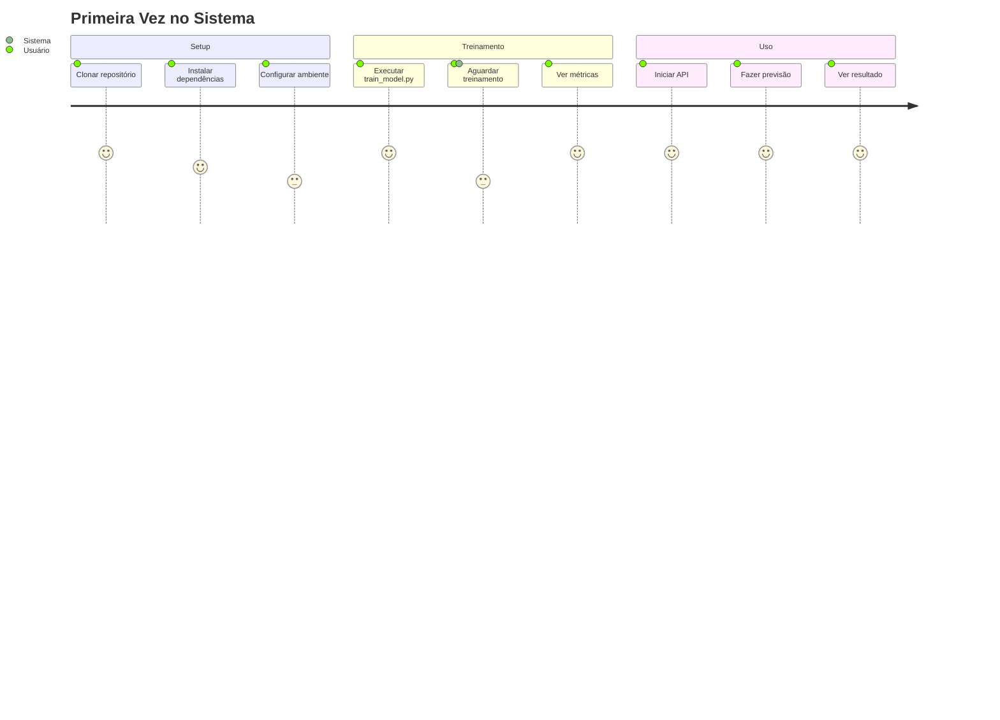

### Cenário 2: Desenvolvedor Contribuindo

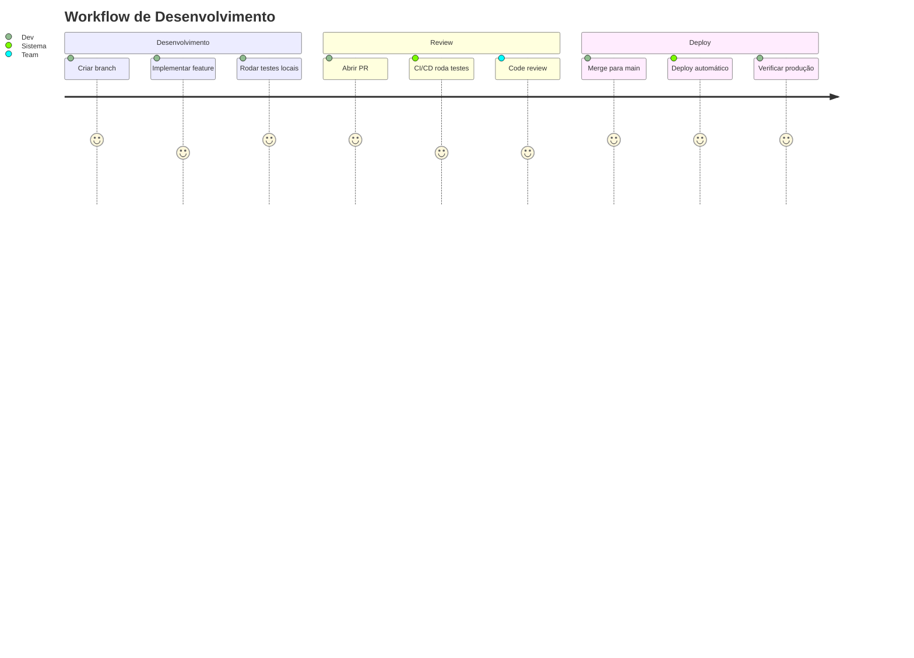

---

## 🏗️ Como os Dados Fluem no Sistema

### Do Yahoo Finance até a Previsão

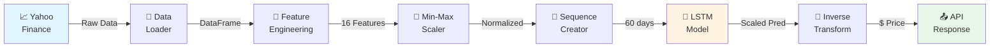

### Transformação dos Dados (Detalhado)

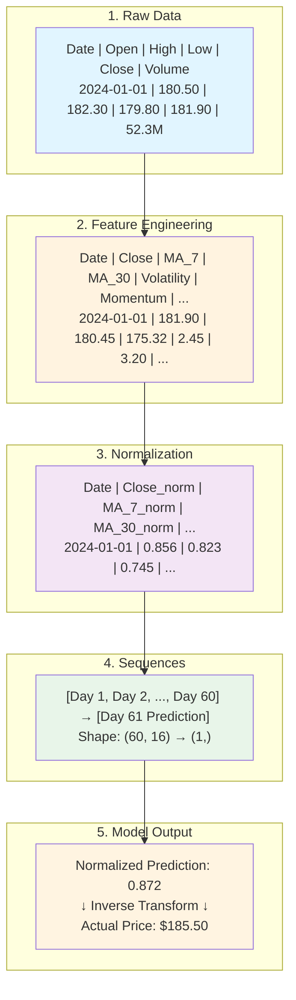

---

## 🧠 Anatomia do Modelo LSTM

### Estrutura Visual

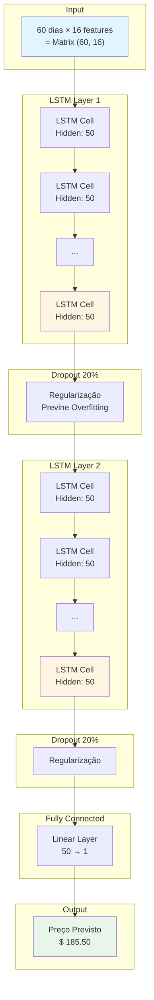

### Como o LSTM "Lembra"

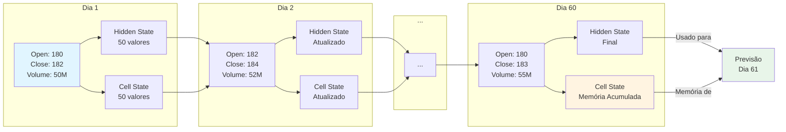

---

## 🔄 Estado do Sistema

### Ciclo de Vida de um Modelo

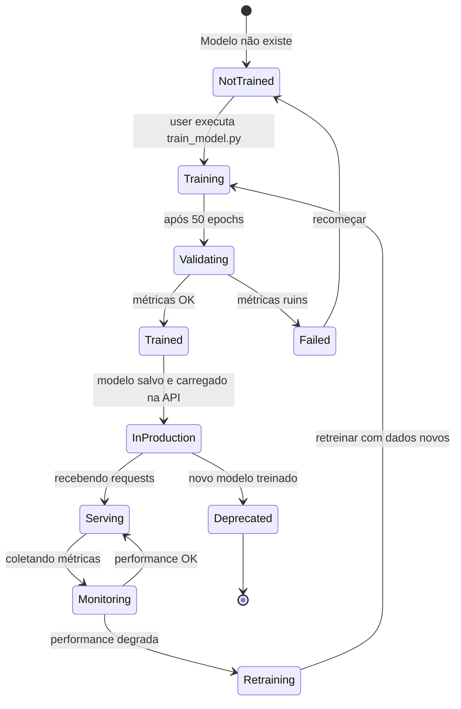

### Estados da API

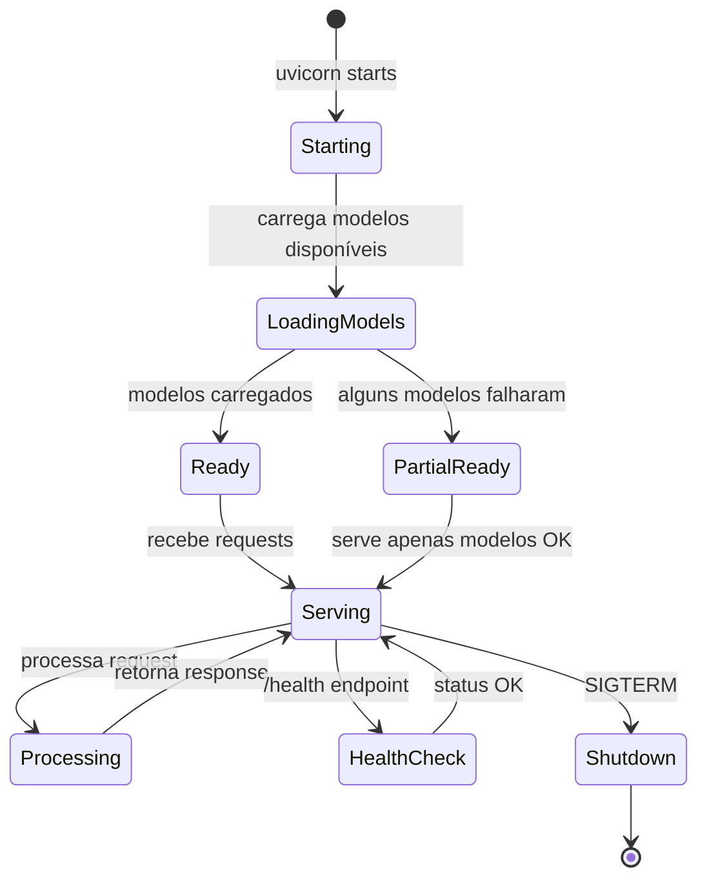

---

## 📊 Métricas Visuais

### O que significa cada métrica?

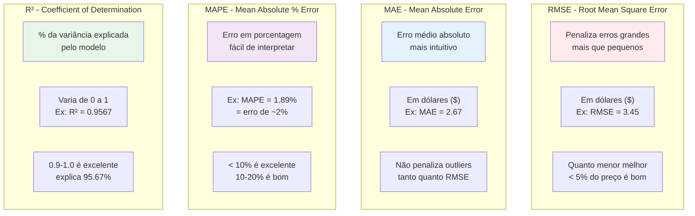

### Exemplo Real de Avaliação

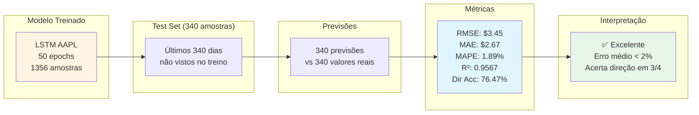

---

## 🌐 Arquitetura de Deploy

### Development Environment

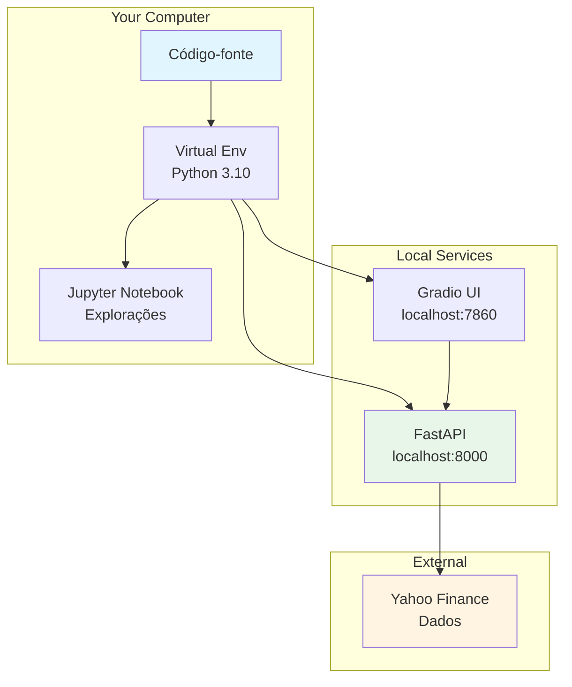

### Production Environment

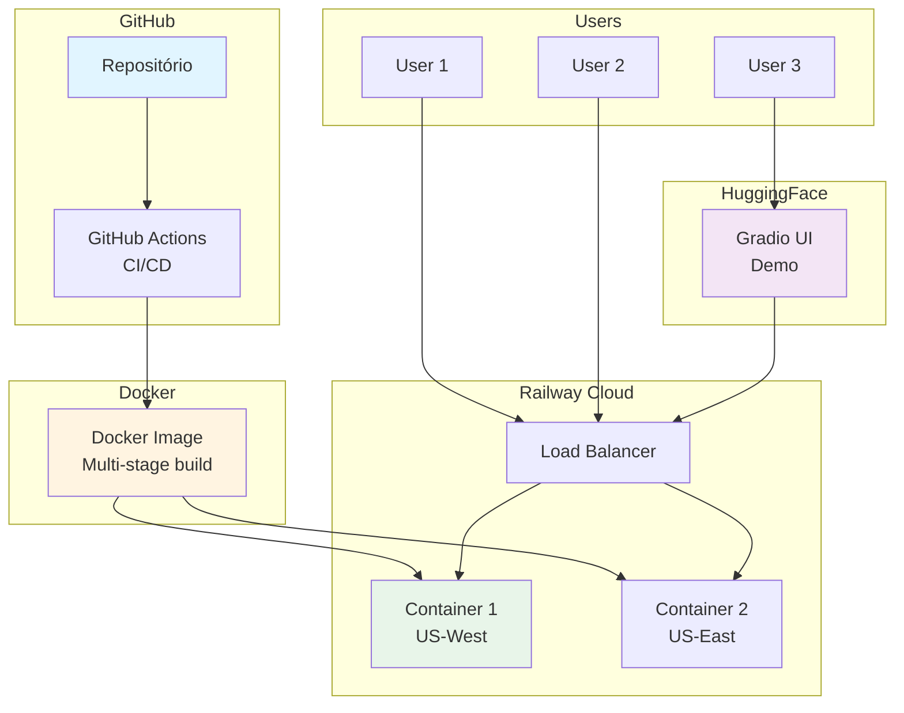

---

## 🔍 Troubleshooting Visual

### Diagnóstico de Problemas

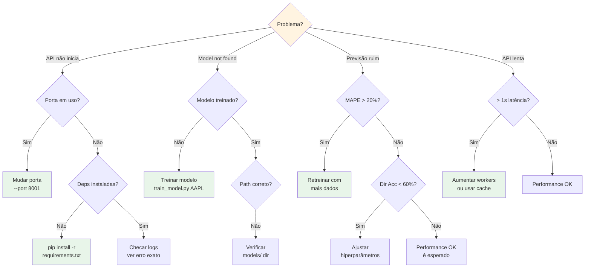

---

## 📈 Evolução do Sistema

### Roadmap Visual

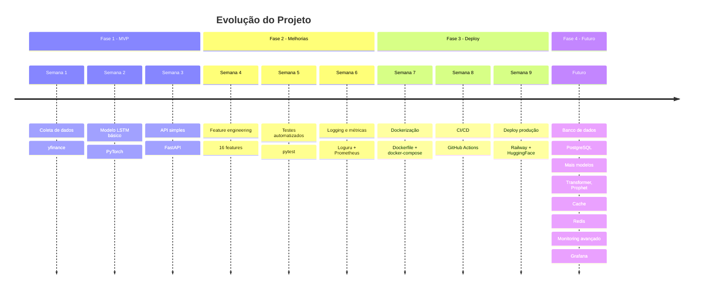

---

## 🎨 Paleta de Cores do Sistema

### Código de Cores para Diagramas

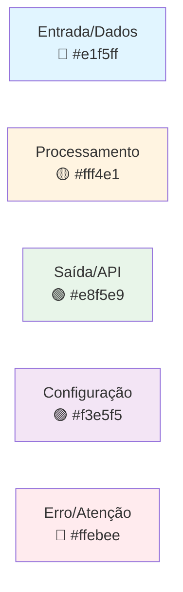

---

## 📚 Glossário Visual

### Termos-Chave Ilustrados

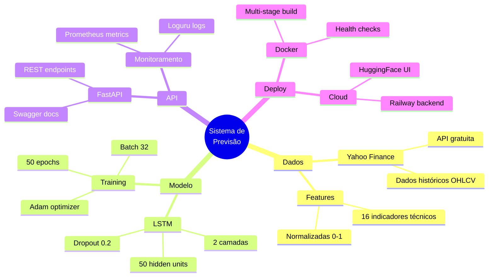

---

**Este guia visual complementa o README principal**

*Use este documento para apresentações e explicações visuais*

*Última atualização: Dezembro 2024*

