# 📈 Sistema de Previsão de Preços de Ações com LSTM

> **Tech Challenge Fase 4 - FIAP Pós-Tech Machine Learning Engineering**
> 
> Um projeto completo de ML Engineering: da coleta de dados ao deploy em produção

[](https://www.python.org/downloads/release/python-3100/)
[](https://fastapi.tiangolo.com/)
[](https://pytorch.org/)
[](https://opensource.org/licenses/MIT)

---

## 📋 Índice

- [Visão Geral do Projeto](#-visão-geral-do-projeto)
- [Arquitetura do Sistema](#-arquitetura-do-sistema)
- [Como Funciona o LSTM](#-como-funciona-o-lstm)
- [Fluxos do Sistema](#-fluxos-do-sistema)
- [Estrutura do Projeto](#-estrutura-do-projeto)
- [Tecnologias Utilizadas](#-tecnologias-utilizadas)
- [Instalação e Configuração](#-instalação-e-configuração)
- [Como Usar](#-como-usar)
- [API Endpoints](#-api-endpoints)
- [Deploy](#-deploy)
- [Técnicas de ML Engineering](#-técnicas-de-ml-engineering)
- [Monitoramento e Testes](#-monitoramento-e-testes)
- [Resultados e Métricas](#-resultados-e-métricas)
- [Troubleshooting](#-troubleshooting)

---

## 🎯 Visão Geral do Projeto

Este projeto é um **sistema completo de Machine Learning** para previsão de preços de ações, desenvolvido seguindo as melhores práticas de ML Engineering. O objetivo é aplicar conhecimentos práticos de forma **simples, replicável e production-ready**.

### O que o Sistema Faz?

1. **Coleta dados** históricos de ações do Yahoo Finance
2. **Processa e cria features** técnicas (médias móveis, volatilidade, etc.)
3. **Treina um modelo LSTM** para capturar padrões temporais
4. **Disponibiliza previsões** via API RESTful
5. **Monitora performance** em tempo real
6. **Deploy em produção** com Docker e Railway

### Por que LSTM?

**LSTM (Long Short-Term Memory)** é uma rede neural recorrente ideal para séries temporais porque:

- ✅ **Memória de longo prazo**: Consegue "lembrar" padrões de dias/semanas atrás
- ✅ **Evita vanishing gradient**: Mantém o aprendizado mesmo com sequências longas
- ✅ **Padrão da indústria**: Amplamente usado em finanças e previsões
- ✅ **Balanceamento**: Não é muito simples nem muito complexo para aprender

---

## 🏗️ Arquitetura do Sistema

### Visão Geral de Alto Nível

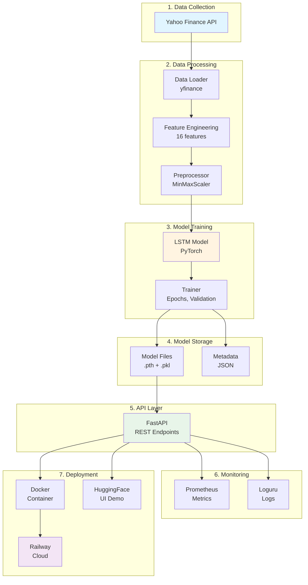

### Arquitetura de Componentes

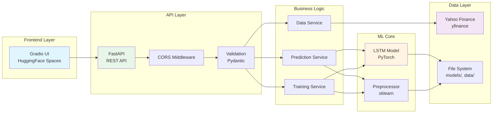

---

## 🧠 Como Funciona o LSTM

### Estrutura do Modelo

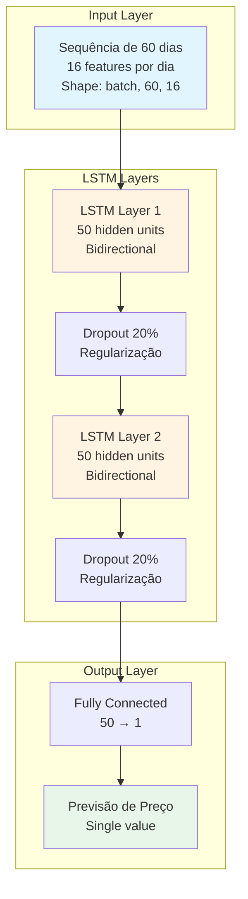

### Features Utilizadas (16 no total)

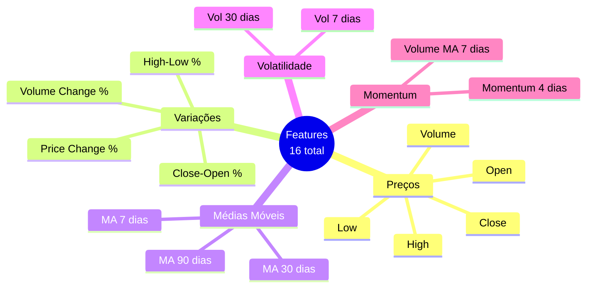

### Por que 16 Features?

| Categoria | Features | Motivo |
|-----------|----------|--------|
| **Preços OHLCV** | 5 features | Dados base essenciais |
| **Variações %** | 4 features | Captura movimentos relativos |
| **Médias Móveis** | 3 features | Identifica tendências |
| **Volatilidade** | 2 features | Mede incerteza/risco |
| **Momentum** | 2 features | Captura força da tendência |

---

## 🔄 Fluxos do Sistema

### 1. Fluxo de Treinamento

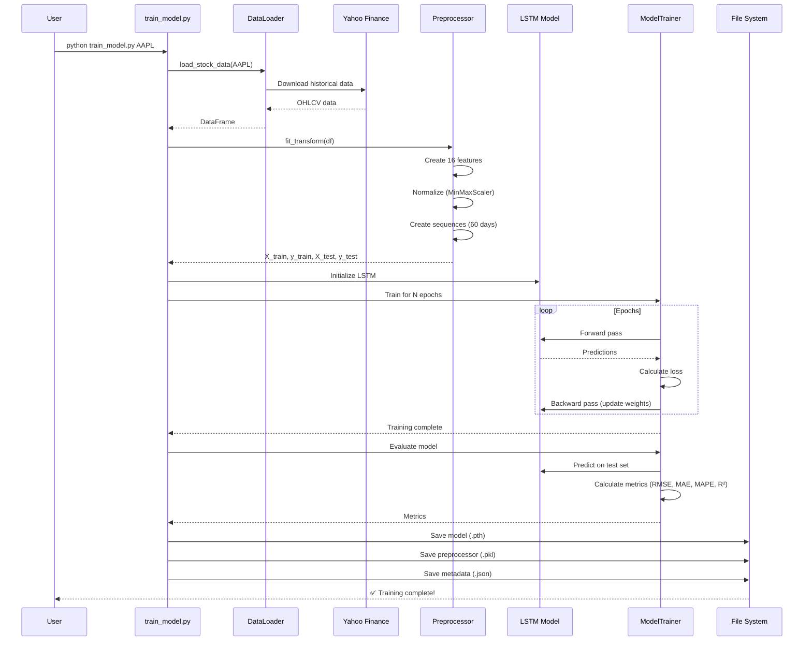

### 2. Fluxo de Predição

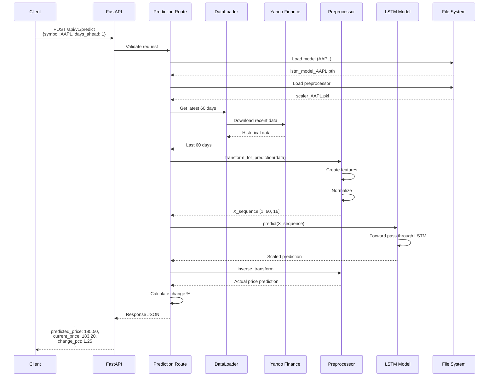

### 3. Fluxo da API Completo

```mermaid
graph TB
    subgraph "Client Layer"
        WEB[Web Browser]
        CLI[CLI/cURL]
        UI[Gradio UI]
    end
    
    subgraph "API Gateway"
        ENTRY[FastAPI Entry Point]
        CORS[CORS Middleware]
        METRICS[Metrics Middleware]
    end
    
    subgraph "Routes"
        PRED[/predict<br/>Predictions]
        DATA[/stocks<br/>Data]
        MODEL[/models<br/>Model Mgmt]
        HEALTH[/health<br/>Monitoring]
    end
    
    subgraph "Services"
        PS[Prediction Service]
        DS[Data Service]
        MS[Model Service]
        MON[Monitoring Service]
    end
    
    subgraph "External"
        YF[Yahoo Finance]
        FS[File System]
        PROM[Prometheus]
    end
    
    WEB --> ENTRY
    CLI --> ENTRY
    UI --> ENTRY
    
    ENTRY --> CORS
    CORS --> METRICS
    METRICS --> PRED
    METRICS --> DATA
    METRICS --> MODEL
    METRICS --> HEALTH
    
    PRED --> PS
    DATA --> DS
    MODEL --> MS
    HEALTH --> MON
    
    PS --> FS
    DS --> YF
    MS --> FS
    MON --> PROM
    
    style ENTRY fill:#e8f5e9
    style PS fill:#fff4e1
    style YF fill:#e1f5ff
```

### 4. Pipeline de Deploy

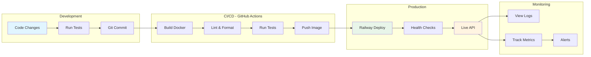

---

## 📁 Estrutura do Projeto

```
previsao_acoes/
│
├── 📊 src/                          # Código-fonte principal
│   ├── api/                         # API FastAPI
│   │   ├── main.py                  # Entry point da API
│   │   ├── schemas.py               # Modelos Pydantic (validação)
│   │   └── routes/                  # Endpoints organizados
│   │       ├── predictions.py       # POST /predict, /predict/batch
│   │       ├── data.py              # GET /stocks/{symbol}/historical
│   │       ├── models.py            # POST /models/train, GET /models/status
│   │       └── monitoring.py        # GET /metrics, /health
│   │
│   ├── data/                        # Coleta e processamento de dados
│   │   ├── data_loader.py           # Download via yfinance
│   │   └── preprocessor.py          # Feature engineering + normalização
│   │
│   ├── models/                      # Modelo LSTM
│   │   └── lstm_model.py            # Arquitetura PyTorch
│   │
│   ├── training/                    # Pipeline de treinamento
│   │   └── trainer.py               # Orquestra todo o treino
│   │
│   └── utils/                       # Utilitários
│       ├── logger.py                # Configuração de logs
│       └── monitoring.py            # Métricas Prometheus
│
├── 🧪 tests/                        # Testes automatizados
│   ├── test_api.py                  # Testa endpoints
│   ├── test_data_loader.py          # Testa coleta de dados
│   ├── test_preprocessor.py         # Testa features
│   └── test_model.py                # Testa LSTM
│
├── 🔧 config/                       # Configurações
│   ├── __init__.py
│   └── settings.py                  # Centralizadas (variáveis de ambiente)
│
├── 📜 scripts/                      # Scripts utilitários
│   ├── train_model.py               # CLI para treinar modelos
│   ├── scheduled_training.sh        # Script para cron jobs
│   └── setup_cron.sh                # Configura treinamento agendado
│
├── 💾 data/                         # Dados (gerado em runtime)
│   ├── raw/                         # Dados brutos do Yahoo Finance
│   └── processed/                   # Dados processados
│
├── 🤖 models/                       # Modelos treinados (gerado)
│   ├── lstm_model_AAPL.pth          # Modelo treinado
│   ├── scaler_AAPL.pkl              # Preprocessador
│   └── metadata_AAPL.json           # Métricas e info
│
├── 📝 logs/                         # Logs da aplicação
│   ├── app_2024-12-02.log           # Logs gerais
│   └── errors_2024-12-02.log        # Apenas erros
│
├── 📓 notebooks/                    # Jupyter notebooks
│   ├── 01_exploratory_data_analysis.ipynb
│   └── 02_entendendo_lstm_passo_a_passo.ipynb
│
├── 🐳 Docker Files
│   ├── Dockerfile                   # Multi-stage build
│   ├── docker-compose.yml           # Orquestração
│   └── .dockerignore               # Otimização
│
├── 🚀 Deploy Files
│   ├── railway.json                 # Config Railway
│   └── app_gradio.py                # UI para HuggingFace Spaces
│
├── 📚 Documentation
│   ├── README.md                    # Documentação principal
│   ├── QUICKSTART.md                # Guia rápido (5 min)
│   ├── DEPLOYMENT.md                # Guia de deploy
│   └── PROJECT_SUMMARY.md           # Resumo executivo
│
├── ⚙️ Configuration Files
│   ├── requirements.txt             # Dependências Python
│   ├── pytest.ini                   # Config de testes
│   ├── .gitignore                   # Git ignore
│   └── .env.example                 # Template de variáveis
│
└── 🔄 CI/CD
    └── .github/
        └── workflows/
            └── ci-cd.yml            # GitHub Actions
```

### Explicação dos Principais Arquivos

| Arquivo | Função | Por que é importante? |
|---------|--------|----------------------|
| `src/models/lstm_model.py` | Arquitetura LSTM em PyTorch | **Cérebro do sistema** - define como o modelo aprende |
| `src/training/trainer.py` | Orquestra treinamento completo | **Pipeline ML** - coleta, treina, avalia, salva |
| `src/data/preprocessor.py` | Cria features e normaliza | **Feature Engineering** - transforma dados brutos em features úteis |
| `src/api/main.py` | Entry point da API | **Interface** - expõe o modelo como serviço |
| `scripts/train_model.py` | CLI para treinar | **Automação** - permite treinar via comando ou cron |
| `config/settings.py` | Configurações centralizadas | **Flexibilidade** - muda comportamento sem alterar código |
| `Dockerfile` | Containerização | **Portabilidade** - roda igual em qualquer lugar |

---

## 🔧 Tecnologias Utilizadas

### Core ML & Data Science

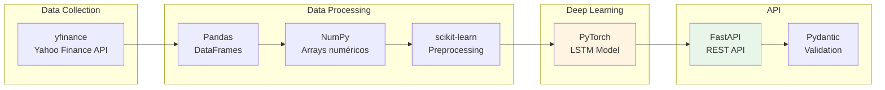

### Detalhamento das Tecnologias

| Tecnologia | Versão | Uso no Projeto | Por que escolhemos? |
|------------|--------|----------------|---------------------|
| **Python** | 3.10 | Linguagem base | Padrão da indústria ML |
| **PyTorch** | 2.0 | Modelo LSTM | Flexível, research-friendly, dinâmico |
| **FastAPI** | 0.104 | API REST | Moderno, rápido, auto-documentado |
| **yfinance** | 0.2.28 | Coleta de dados | API gratuita e confiável |
| **scikit-learn** | 1.3 | Preprocessing | MinMaxScaler, métricas |
| **Pandas** | 2.0 | Manipulação de dados | Análise de séries temporais |
| **NumPy** | 1.24 | Arrays numéricos | Performance em operações |
| **Uvicorn** | 0.24 | ASGI server | Serve a API FastAPI |
| **Docker** | - | Containerização | Deploy consistente |
| **Prometheus** | - | Métricas | Monitoramento production |
| **Loguru** | 0.7 | Logging | Logs estruturados e bonitos |
| **Pytest** | 7.4 | Testes | Framework de teste padrão |

### Stack de Deploy

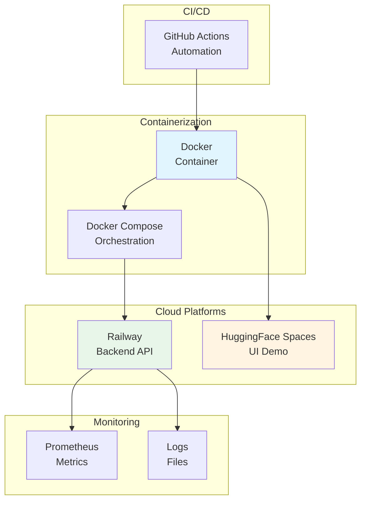

---

## 🚀 Instalação e Configuração

### Pré-requisitos

- **Python 3.10+** ([Download](https://www.python.org/downloads/))
- **Git** ([Download](https://git-scm.com/))
- **(Opcional) Docker** ([Download](https://www.docker.com/))

### Opção 1: Instalação Local (Recomendado para Desenvolvimento)

#### 1. Clone o Repositório

```bash
git clone https://github.com/your-username/previsao_acoes.git
cd previsao_acoes
```

#### 2. Crie um Ambiente Virtual

```bash
# Linux/Mac
python -m venv venv
source venv/bin/activate

# Windows
python -m venv venv
venv\Scripts\activate
```

#### 3. Instale as Dependências

```bash
pip install --upgrade pip
pip install -r requirements.txt
```

#### 4. Configure Variáveis de Ambiente (Opcional)

```bash
# Copie o template
cp .env.example .env

# Edite o arquivo .env
nano .env
```

Exemplo de `.env`:

```bash
# API Configuration
API_HOST=0.0.0.0
API_PORT=8000
API_WORKERS=1

# Model Configuration
DEFAULT_STOCK_SYMBOL=AAPL
DEFAULT_START_DATE=2018-01-01
DEFAULT_END_DATE=2024-12-31

# LSTM Hyperparameters
LSTM_SEQUENCE_LENGTH=60
LSTM_EPOCHS=50
LSTM_BATCH_SIZE=32
LSTM_LEARNING_RATE=0.001

# Monitoring
LOG_LEVEL=INFO
```

### Opção 2: Instalação com Docker

```bash
# Build e run
docker-compose up --build

# Acesse a API em http://localhost:8000
```

---

## 💻 Como Usar

### 1. Treinar um Modelo

```bash
# Treinar modelo para Apple (AAPL)
python scripts/train_model.py AAPL

# Com período customizado
python scripts/train_model.py AAPL --start-date 2020-01-01 --end-date 2024-12-31

# Com hiperparâmetros customizados
python scripts/train_model.py GOOGL --epochs 100 --batch-size 64
```

**O que acontece durante o treinamento:**

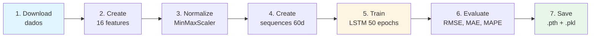

**Output esperado:**

```
2024-12-02 10:00:00 | INFO | Loading data for AAPL
2024-12-02 10:00:05 | INFO | Successfully loaded 1756 records
2024-12-02 10:00:06 | INFO | Preprocessing data
2024-12-02 10:00:07 | INFO | Created 1696 sequences with shape (1696, 60, 16)
2024-12-02 10:00:07 | INFO | Train set: 1356 samples, Test set: 340 samples
2024-12-02 10:00:08 | INFO | Starting training for 50 epochs
2024-12-02 10:02:45 | INFO | Epoch [10/50] Train Loss: 0.002345, Val Loss: 0.002891
...
2024-12-02 10:15:23 | INFO | Training completed
2024-12-02 10:15:24 | INFO | Evaluating model
2024-12-02 10:15:25 | INFO |   RMSE: 3.45
2024-12-02 10:15:25 | INFO |   MAE: 2.67
2024-12-02 10:15:25 | INFO |   MAPE: 1.89%
2024-12-02 10:15:25 | INFO |   R²: 0.9567
2024-12-02 10:15:25 | INFO |   Directional Accuracy: 76.47%
2024-12-02 10:15:26 | INFO | Model saved to models/lstm_model_AAPL.pth
✅ Training complete!
```

### 2. Iniciar a API

```bash
# Desenvolvimento (com auto-reload)
python -m uvicorn src.api.main:app --reload --host 0.0.0.0 --port 8000

# Produção (com múltiplos workers)
python -m uvicorn src.api.main:app --host 0.0.0.0 --port 8000 --workers 4
```

**Acesse a documentação interativa:**

- **Swagger UI**: http://localhost:8000/docs
- **ReDoc**: http://localhost:8000/redoc

### 3. Fazer Previsões

#### Via cURL

```bash
# Previsão simples (1 dia à frente)
curl -X POST "http://localhost:8000/api/v1/predict" \
  -H "Content-Type: application/json" \
  -d '{
    "symbol": "AAPL",
    "days_ahead": 1
  }'
```

**Response:**

```json
{
  "symbol": "AAPL",
  "current_price": 183.20,
  "predicted_price": 185.50,
  "prediction_date": "2024-12-03",
  "change_percentage": 1.25,
  "confidence": "high",
  "timestamp": "2024-12-02T10:30:00"
}
```

#### Via Python

```python
import requests

response = requests.post(
    "http://localhost:8000/api/v1/predict",
    json={"symbol": "AAPL", "days_ahead": 1}
)

data = response.json()
print(f"Preço atual: ${data['current_price']:.2f}")
print(f"Previsão: ${data['predicted_price']:.2f}")
print(f"Variação: {data['change_percentage']:.2f}%")
```

#### Previsões em Lote

```bash
curl -X POST "http://localhost:8000/api/v1/predict/batch" \
  -H "Content-Type: application/json" \
  -d '{
    "symbols": ["AAPL", "GOOGL", "MSFT"],
    "days_ahead": 1
  }'
```

### 4. Acessar Dados Históricos

```bash
# Últimos 365 dias
curl "http://localhost:8000/api/v1/stocks/AAPL/historical?limit=365"

# Preço mais recente
curl "http://localhost:8000/api/v1/stocks/AAPL/latest"
```

### 5. Verificar Status dos Modelos

```bash
# Status de todos os modelos
curl "http://localhost:8000/api/v1/models/status"

# Performance de um modelo específico
curl "http://localhost:8000/api/v1/models/AAPL/performance"
```

### 6. Monitoramento

```bash
# Health check
curl "http://localhost:8000/api/v1/health"

# Métricas da API
curl "http://localhost:8000/api/v1/metrics"

# Métricas Prometheus
curl "http://localhost:8000/api/v1/metrics/prometheus"
```

---

## 🌐 API Endpoints

### Documentação Completa

| Método | Endpoint | Descrição | Request | Response |
|--------|----------|-----------|---------|----------|
| **POST** | `/api/v1/predict` | Previsão para uma ação | `{symbol, days_ahead}` | `{predicted_price, current_price, ...}` |
| **POST** | `/api/v1/predict/batch` | Previsões em lote | `{symbols[], days_ahead}` | `{predictions[]}` |
| **GET** | `/api/v1/stocks/{symbol}/historical` | Dados históricos | `?limit=365` | `{data[]}` |
| **GET** | `/api/v1/stocks/{symbol}/latest` | Preço atual | - | `{current_price, volume, ...}` |
| **GET** | `/api/v1/stocks/available` | Ações com modelo treinado | - | `{stocks[], count}` |
| **POST** | `/api/v1/models/train` | Treinar/retreinar modelo | `{symbol, start_date, end_date}` | `{status, metrics}` |
| **GET** | `/api/v1/models/status` | Status de todos os modelos | - | `{models[], count}` |
| **GET** | `/api/v1/models/{symbol}/performance` | Métricas de um modelo | - | `{rmse, mae, mape, r2}` |
| **GET** | `/api/v1/health` | Health check | - | `{status: healthy}` |
| **GET** | `/api/v1/metrics` | Métricas da API | - | `{requests, latency, uptime}` |
| **GET** | `/api/v1/metrics/prometheus` | Métricas Prometheus | - | Formato Prometheus |

### Exemplos de Uso Completos

#### 1. Workflow Completo: Treinar e Prever

```python
import requests
import time

API_URL = "http://localhost:8000"

# 1. Treinar modelo
print("1. Treinando modelo...")
response = requests.post(
    f"{API_URL}/api/v1/models/train",
    json={
        "symbol": "AAPL",
        "start_date": "2020-01-01",
        "end_date": "2024-12-31",
        "epochs": 50
    }
)
print(f"Status: {response.json()}")

# 2. Verificar status
print("\n2. Verificando status do modelo...")
response = requests.get(f"{API_URL}/api/v1/models/status")
print(f"Modelos disponíveis: {response.json()['count']}")

# 3. Ver performance
print("\n3. Métricas do modelo...")
response = requests.get(f"{API_URL}/api/v1/models/AAPL/performance")
metrics = response.json()
print(f"RMSE: {metrics['rmse']:.2f}")
print(f"MAPE: {metrics['mape']:.2f}%")

# 4. Fazer previsão
print("\n4. Fazendo previsão...")
response = requests.post(
    f"{API_URL}/api/v1/predict",
    json={"symbol": "AAPL", "days_ahead": 1}
)
pred = response.json()
print(f"Preço atual: ${pred['current_price']:.2f}")
print(f"Previsão: ${pred['predicted_price']:.2f}")
print(f"Variação: {pred['change_percentage']:.2f}%")
```

---

## 🚢 Deploy

### 1. Deploy com Railway (Backend API)

Railway é uma plataforma cloud simples e com tier gratuito.

#### Passo a Passo

```bash
# 1. Instale Railway CLI
npm i -g @railway/cli

# 2. Login
railway login

# 3. Inicialize projeto
railway init

# 4. Configure variáveis de ambiente
railway variables set DEFAULT_STOCK_SYMBOL=AAPL
railway variables set LSTM_EPOCHS=50

# 5. Deploy
railway up
```

#### Ou via GitHub (Recomendado)

1. Conecte seu repositório no [Railway Dashboard](https://railway.app/)
2. Configure variáveis de ambiente no dashboard
3. Cada push no `main` faz deploy automaticamente

**Variáveis de ambiente necessárias:**

```bash
API_HOST=0.0.0.0
API_PORT=8000
DEFAULT_STOCK_SYMBOL=AAPL
LSTM_EPOCHS=50
LSTM_BATCH_SIZE=32
LOG_LEVEL=INFO
```

### 2. Deploy HuggingFace Spaces (UI Demo)

HuggingFace Spaces hospeda demos Gradio gratuitamente.

#### Passo a Passo

```bash
# 1. Crie um Space em https://huggingface.co/spaces
# Escolha SDK: Gradio

# 2. Clone o space
git clone https://huggingface.co/spaces/your-username/stock-prediction

# 3. Copie arquivos necessários
cp app_gradio.py stock-prediction/app.py
cd stock-prediction

# 4. Crie requirements.txt específico
cat > requirements.txt << EOF
gradio==4.0.0
requests==2.31.0
pandas==2.0.3
plotly==5.17.0
EOF

# 5. Commit e push
git add .
git commit -m "Add Gradio interface"
git push

# Space estará disponível em:
# https://huggingface.co/spaces/your-username/stock-prediction
```

### 3. Deploy com Docker

#### Build e Run Local

```bash
# Build
docker build -t stock-prediction-api:latest .

# Run
docker run -d \
  --name stock-api \
  -p 8000:8000 \
  -v $(pwd)/models:/app/models \
  -v $(pwd)/data:/app/data \
  -e DEFAULT_STOCK_SYMBOL=AAPL \
  stock-prediction-api:latest

# Logs
docker logs -f stock-api
```

#### Docker Compose (Recomendado)

```bash
# Start
docker-compose up -d

# Logs
docker-compose logs -f

# Stop
docker-compose down
```

---

## 🎓 Técnicas de ML Engineering Aplicadas

Este projeto segue as melhores práticas de ML Engineering:

### 1. **Separation of Concerns**

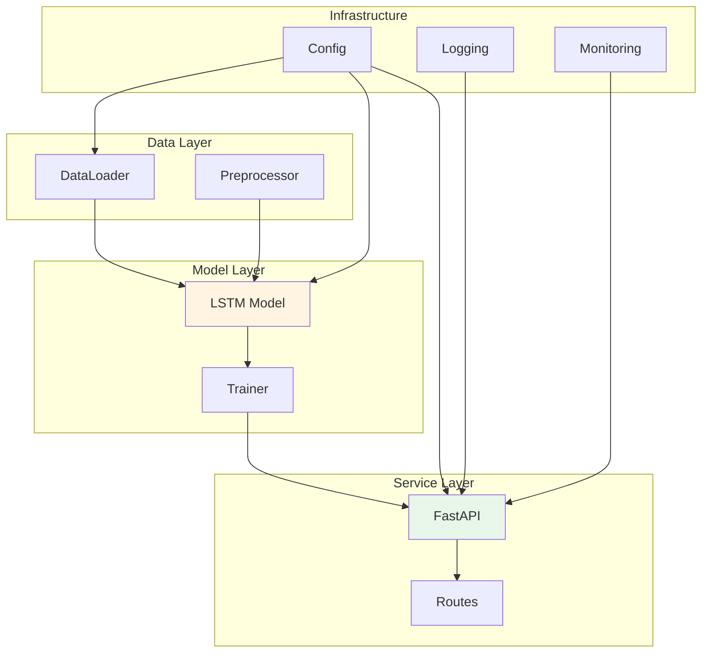

**Cada componente tem uma responsabilidade clara:**

- `DataLoader`: Apenas coleta dados
- `Preprocessor`: Apenas transforma dados
- `LSTMModel`: Apenas define arquitetura
- `Trainer`: Apenas treina
- `API`: Apenas serve o modelo

### 2. **Configuration Management**

```python
# Todas as configurações em um lugar
# config/settings.py

LSTM_SEQUENCE_LENGTH = int(os.getenv("LSTM_SEQUENCE_LENGTH", "60"))
LSTM_EPOCHS = int(os.getenv("LSTM_EPOCHS", "50"))
LSTM_BATCH_SIZE = int(os.getenv("LSTM_BATCH_SIZE", "32"))
```

**Benefícios:**
- ✅ Muda comportamento sem alterar código
- ✅ Diferentes configs para dev/prod
- ✅ Fácil de testar com configs diferentes

### 3. **Model Versioning**

```python
# Modelos salvos com metadata
{
  "symbol": "AAPL",
  "trained_at": "2024-12-02T10:15:26",
  "metrics": {
    "rmse": 3.45,
    "mae": 2.67,
    "mape": 1.89
  },
  "hyperparameters": {
    "epochs": 50,
    "batch_size": 32,
    "learning_rate": 0.001
  }
}
```

### 4. **Logging e Monitoring**

```python
# Logs estruturados
logger.info(f"Prediction for {symbol}: ${price:.2f}")

# Métricas Prometheus
metrics_collector.record_request(
    method="POST",
    endpoint="/predict",
    status=200,
    duration=0.234
)
```

### 5. **Testing**

```python
# Testes automatizados para cada componente
pytest tests/test_api.py -v
pytest tests/test_model.py -v
pytest tests/test_preprocessor.py -v
```

### 6. **Containerization**

```dockerfile
# Multi-stage build otimizado
FROM python:3.10-slim as base
# ...instala dependências...

FROM python:3.10-slim
# ...copia apenas o necessário...
```

### 7. **CI/CD Pipeline**

```yaml
# .github/workflows/ci-cd.yml
- name: Run tests
  run: pytest
  
- name: Build Docker
  run: docker build .
  
- name: Deploy to Railway
  if: github.ref == 'refs/heads/main'
```

### 8. **API Best Practices**

- ✅ **Validação** com Pydantic
- ✅ **Documentação automática** (Swagger)
- ✅ **Error handling** robusto
- ✅ **CORS** configurado
- ✅ **Health checks**
- ✅ **Versionamento** (`/api/v1`)

### 9. **Model Deployment Patterns**

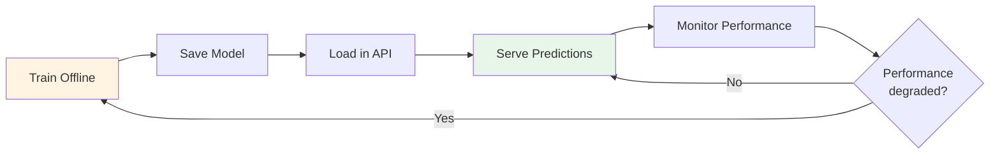

---

## 📊 Monitoramento e Testes

### Testes Automatizados

```bash
# Todos os testes
pytest

# Com verbosidade
pytest -v

# Com cobertura
pytest --cov=src tests/

# Testes específicos
pytest tests/test_api.py::test_prediction -v
```

### Estrutura de Testes

```
tests/
├── test_api.py              # Testa endpoints
├── test_data_loader.py      # Testa coleta de dados
├── test_preprocessor.py     # Testa feature engineering
└── test_model.py            # Testa LSTM
```

### Monitoramento em Produção

#### 1. Health Checks

```bash
# Verificar se a API está saudável
curl http://localhost:8000/api/v1/health

# Response:
{
  "status": "healthy",
  "timestamp": "2024-12-02T10:30:00",
  "version": "1.0.0"
}
```

#### 2. Métricas da API

```bash
curl http://localhost:8000/api/v1/metrics

# Response:
{
  "total_requests": 1523,
  "successful_requests": 1489,
  "failed_requests": 34,
  "average_latency_ms": 234.5,
  "uptime_seconds": 86400,
  "predictions_made": 456
}
```

#### 3. Métricas Prometheus

```bash
curl http://localhost:8000/api/v1/metrics/prometheus

# Response (formato Prometheus):
# TYPE api_requests_total counter
api_requests_total{method="POST",endpoint="/predict",status="200"} 1523.0
# TYPE api_request_duration_seconds histogram
api_request_duration_seconds_bucket{le="0.1"} 456.0
```

#### 4. Logs

```bash
# Logs em tempo real
tail -f logs/app_2024-12-02.log

# Apenas erros
tail -f logs/errors_2024-12-02.log
```

---

## 📈 Resultados e Métricas

### Métricas de Avaliação

O modelo é avaliado usando 5 métricas principais:

#### 1. **RMSE (Root Mean Square Error)**

```
RMSE = √(Σ(predicted - actual)² / n)
```

- **O que mede**: Erro médio em dólares
- **Bom valor**: < 5% do preço médio
- **Exemplo**: RMSE de $3.45 para AAPL ($183) = 1.88%

#### 2. **MAE (Mean Absolute Error)**

```
MAE = Σ|predicted - actual| / n
```

- **O que mede**: Erro absoluto médio
- **Bom valor**: < 3% do preço médio
- **Exemplo**: MAE de $2.67 para AAPL = 1.46%

#### 3. **MAPE (Mean Absolute Percentage Error)**

```
MAPE = (Σ|actual - predicted| / |actual|) / n × 100%
```

- **O que mede**: Erro percentual médio
- **Interpretação**:
  - < 10%: Excelente
  - 10-20%: Bom
  - 20-50%: Aceitável
  - \> 50%: Ruim

#### 4. **R² (Coefficient of Determination)**

```
R² = 1 - (SS_res / SS_tot)
```

- **O que mede**: % da variância explicada
- **Interpretação**:
  - 0.9-1.0: Excelente
  - 0.7-0.9: Bom
  - 0.5-0.7: Moderado
  - < 0.5: Ruim

#### 5. **Directional Accuracy**

```
DA = (# direções corretas / # previsões) × 100%
```

- **O que mede**: % de vezes que acertou a direção (subida/descida)
- **Bom valor**: > 60%

### Exemplo de Resultados

```
=== Métricas do Modelo AAPL ===
RMSE:                    3.45
MAE:                     2.67
MAPE:                    1.89%  ← Excelente!
R²:                      0.9567 ← Muito bom!
Directional Accuracy:    76.47% ← Bom!
Test Samples:            340

Interpretação:
✅ Modelo com boa capacidade preditiva
✅ Erro percentual baixo (< 2%)
✅ Alta capacidade de explicar variância
✅ Acerta direção em 3 de cada 4 casos
```

---

## 🐛 Troubleshooting

### Problemas Comuns

#### 1. "Model not found"

**Erro:**
```
FileNotFoundError: Model file not found for symbol AAPL
```

**Solução:**
```bash
# Treine o modelo primeiro
python scripts/train_model.py AAPL
```

#### 2. "Port already in use"

**Erro:**
```
Error: [Errno 48] Address already in use
```

**Solução:**
```bash
# Use outra porta
uvicorn src.api.main:app --port 8001

# Ou mate o processo na porta 8000
lsof -ti:8000 | xargs kill -9
```

#### 3. "Module not found"

**Erro:**
```
ModuleNotFoundError: No module named 'src'
```

**Solução:**
```bash
# Certifique-se de estar na raiz do projeto
cd /path/to/previsao_acoes

# E que o ambiente virtual está ativado
source venv/bin/activate

# Reinstale dependências
pip install -r requirements.txt
```

#### 4. "Insufficient data"

**Erro:**
```
ValueError: Need at least 60 rows, got 45
```

**Solução:**
```bash
# Use um período maior (mínimo 60 dias)
python scripts/train_model.py AAPL --start-date 2024-01-01 --end-date 2024-12-31
```

#### 5. "CUDA out of memory" (GPU)

**Solução:**
```bash
# Reduza o batch size
python scripts/train_model.py AAPL --batch-size 16

# Ou force uso de CPU
export CUDA_VISIBLE_DEVICES=""
```

---

## 🎓 Conceitos Aprendidos

Este projeto cobre os principais conceitos de ML Engineering:

### 1. **Data Engineering**
- Coleta de dados de APIs externas
- Validação e limpeza de dados
- Feature engineering (16 features técnicas)
- Normalização com MinMaxScaler

### 2. **Deep Learning**
- Arquitetura LSTM (recurrent networks)
- Training loop (forward, backward, update)
- Regularização (dropout)
- Métricas de avaliação

### 3. **MLOps**
- Model versioning
- Reproducibilidade
- Logging estruturado
- Monitoring com métricas

### 4. **API Development**
- REST API com FastAPI
- Validação com Pydantic
- Documentação automática
- Error handling

### 5. **DevOps**
- Containerização com Docker
- CI/CD com GitHub Actions
- Deploy em cloud (Railway)
- Health checks

### 6. **Software Engineering**
- Clean code
- Separation of concerns
- Testing automatizado
- Configuration management

---

## 📚 Próximos Passos

### Para Melhorar o Modelo

1. **Adicionar mais features**
   - Indicadores técnicos (RSI, MACD, Bollinger Bands)
   - Dados de sentimento (notícias, Twitter)
   - Dados macroeconômicos

2. **Experimentar outras arquiteturas**
   - Attention mechanisms
   - Transformer models
   - Ensemble de modelos

3. **Hyperparameter tuning**
   - Grid search
   - Random search
   - Optuna (Bayesian optimization)

### Para Melhorar a Infraestrutura

1. **Banco de dados**
   - PostgreSQL para histórico
   - Redis para cache
   - Timescale para séries temporais

2. **Autenticação**
   - JWT tokens
   - Rate limiting
   - API keys

3. **A/B Testing**
   - Testar múltiplas versões do modelo
   - Gradual rollout

4. **Retreinamento automático**
   - Agendar retreinamento semanal
   - Detectar data drift
   - Rollback automático se performance cair

---

## 🤝 Contribuindo

Este projeto é educacional e aceita contribuições!

```bash
# 1. Fork o projeto
# 2. Crie uma branch
git checkout -b feature/nova-feature

# 3. Faça suas mudanças e commit
git commit -m "Add: nova feature incrível"

# 4. Push para sua branch
git push origin feature/nova-feature

# 5. Abra um Pull Request
```

---

## 📝 Licença

Este projeto está sob a licença MIT. Veja o arquivo [LICENSE](LICENSE) para mais detalhes.

---

## 👨‍💻 Autor

**Seu Nome** - Tech Challenge Fase 4 - FIAP Pós-Tech MLET

- GitHub: [@seu-usuario](https://github.com/seu-usuario)
- LinkedIn: [seu-perfil](https://linkedin.com/in/seu-perfil)
- Email: seu.email@exemplo.com

---

## 🙏 Agradecimentos

- **FIAP** - Pós-Tech Machine Learning Engineering
- **Comunidade Python** - Bibliotecas incríveis
- **Yahoo Finance** - Dados gratuitos e confiáveis
- **FastAPI** - Framework moderno e rápido
- **PyTorch** - Deep learning flexível

---

## ⚠️ Disclaimer

**IMPORTANTE**: Este é um projeto educacional desenvolvido para fins de aprendizado.

**NÃO USE** este sistema para tomar decisões reais de investimento. O mercado de ações é altamente volátil e imprevisível. Modelos de ML podem ter boa performance em dados históricos mas não garantem resultados futuros.

**Sempre consulte um profissional financeiro qualificado antes de investir.**

---

## 📞 Suporte

- **Issues**: [GitHub Issues](https://github.com/seu-usuario/previsao_acoes/issues)
- **Discussões**: [GitHub Discussions](https://github.com/seu-usuario/previsao_acoes/discussions)
- **Email**: seu.email@exemplo.com

---

**Desenvolvido com ❤️ para aprender ML Engineering na prática**

*Última atualização: Dezembro 2024*

